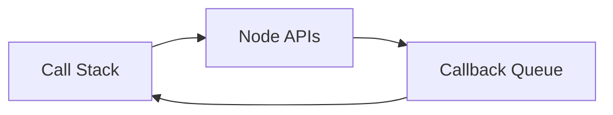

`global` equals to the `window` of the browser

`process` may equal to the `document` of the browser


# Note App (node fundamentals)

## modules

1. `fs` file system
2. `os` operation sys
3. `const fs = require('fs')` to import a module 
4. `const note = require('./note.js')` must use the relative path to include a file
5. `module.exports.<st> = <clause>`
6. `module.exports={}`

## npm

1. `npm init` to  create a `package.json` file 
2. `npm install <module name> --save` 
3. `-` *lodash* is a convenient utility module
4. `npm install` will load the `package.json` file and  install all the dependencies modules
5. `npm install <module> -g` will install the module as a global module (mostly like a utility tool)

## Inputs

1. `process.argv` has the input with the command line which the user input starts from the `process.argv[2]`
2. `yargs` module for easing parsing command line input
3. `fs.writeFileSync(<file name>,<string>)`
4. `fs.readFileSync(<file name>)`

## JSON

1. `JSON.stringify()`
2. `JSON.parse()`

##Debug

###Node > version 8

1. `node inspect <filename>` to enter the debug mode
2. `list(<num>)` to show <num> next lines
3. `n` to run to next line
4. `c` to run left lines
5. `repl` to enter the repl mode to fetch the value of the variable in the current condition
6. `debugger` in the file will create a break point in the process for using `c` in the cli to go to this break point

### Chrome Dev Tools

1. `node --inspect-brk <filename>` to enter the debug mode
2. then go to **chrome** and type `chrome://inspect`


# Weather App (Asynchronous)

## Basics

1. setTimeout(<callback>,<delay milliseconds>)




### Call Stack & Event Loop

1. the call stack, node APIs and the callback queue forms the **Event Loop**
2. synchronous function first go into **Call Stack** and after processed it pushed out
   1. the first function in the stack is the **Main()** function which stands for the whole file
   2. a defined function will first register itself and when called then it will start its clause
3. call stack only has two functions:
   1. adding item on the top of the stack
   2. removing item from the top of the stack
4. asynchronous function first register it self in the Node APIs (to wait for specific condition met like passing exact time). When the condition is met, it is pushed to the Callback Queue. Only when the Call stack is empty, the Callback queue will be processed.

## ES6 Promises

1. `let somePromise = new Promise((resolve, reject) =>{});` resolve and reject is like return which will return the value back to the Promise.then() function and stop the function which means the promise function can only return once no matter it's resolve or reject
2. `somePromise.then(<call back>, <call back>);` first call back is handling the situation resolved and the second call back is handling the situation rejected
3. wrap a promise in a normal function, `return new Promise()`
4. promise can be chained and use`.catch((err)=>{})`to handle any error conditions in the promise chain.
5. **axio** is a **request** like library which is fulfilled by promise


# Web Server (Express)

1. ``` javascript
   const express = require('express');
   let app = express();
   app.get('/',(req, res)=>{
       res.send()
   });
   app.listen(3000);
   ```

2. 